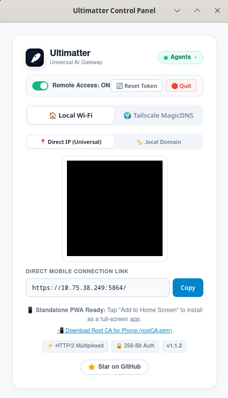
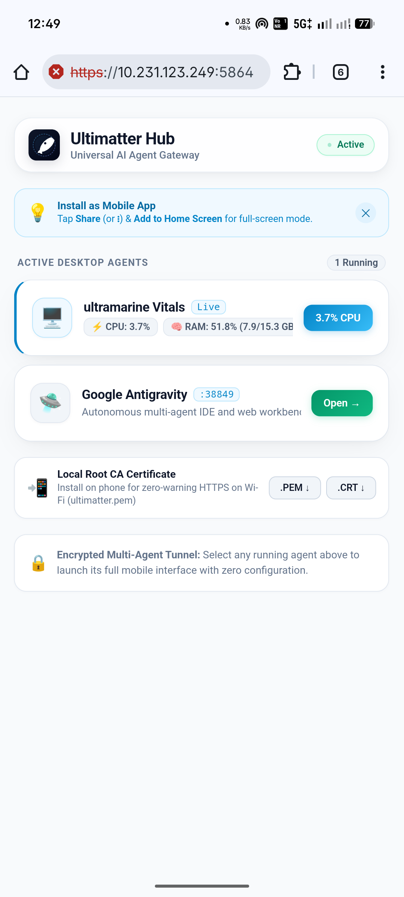
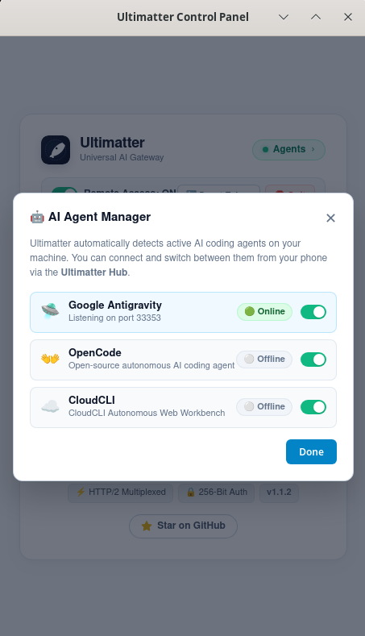
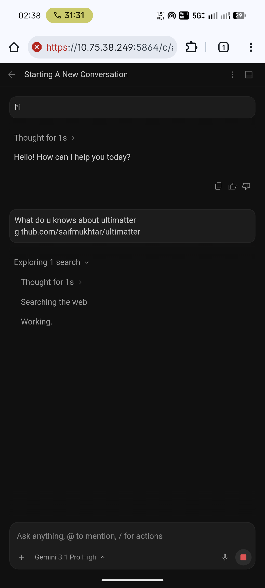
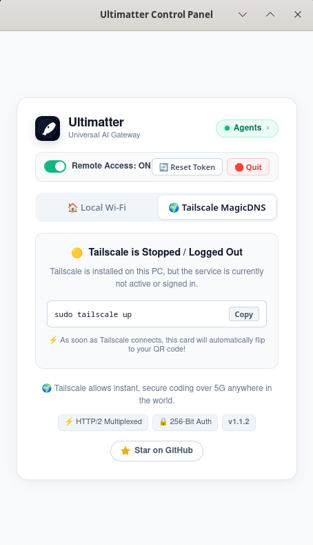

# Ultimatter

> **Universal Mobile Gateway SDK** — wrap any local web service or AI agent with encrypted mobile access, QR pairing, and a native PWA in seconds.

[](https://www.npmjs.com/package/ultimatter)
[](LICENSE)
[]()

<br>

<p align="center">
  
  &nbsp;&nbsp;
  
</p>

---

## Two things in one

**📦 A Node.js SDK** — `npm install ultimatter` to wrap any local port with secure mobile HTTPS access in 3 lines of code.

**🖥️ A standalone desktop app** — pre-built binary for Linux, macOS, and Windows. Point-and-click mobile access to your AI coding agents with auto-discovery, QR pairing, and a live Mobile Hub.

---

## SDK Quick Start

```bash
npm install ultimatter
```

```javascript
const { createMobileGateway } = require('ultimatter');

await createMobileGateway({
  target:  3000,         // local port or URL to proxy
  name:    'My App',     // name shown on the Mobile Hub
  printQr: true,         // print QR code to terminal
});
// → Starts HTTPS proxy on :5864, generates local TLS cert, shows QR code
```

See the full **[SDK & Library Reference →](lib/)** for all options and the programmatic API.

---

## Standalone App

Download for your platform from **[GitHub Releases](https://github.com/saifmukhtar/ultimatter/releases)**:

| Platform | Download |
|----------|----------|
| 🐧 Linux (Desktop GUI) | `Ultimatter-x86_64.AppImage` |
| 🐧 Linux (Headless / Server) | `ultimatter-linux-x64 --headless` |
| 🍎 macOS | `Ultimatter.app` |
| 🪟 Windows | `ultimatter-windows-x64.exe` |

### How to connect your phone

1. Scan the QR code on the desktop control panel with your phone camera.
2. Download and install the **Root CA certificate** (`ultimatter.pem`) shown on the Mobile Hub — one-time step for trusted HTTPS.
3. Tap **Add to Home Screen** (iOS) or **Install App** (Android) to install as a full-screen PWA.
4. Tap any agent card to enter the full-screen session.

---

## Supported AI Agents

Ultimatter auto-discovers running agent processes via in-memory OS port inspection — no plugins, no config.

<p align="center">
  
</p>

| Agent | Auto-discovered at |
|-------|--------------------|
| 🛸 **Google Antigravity** | `:33353` |
| 👐 **OpenCode** | `:4096` |
| 🧠 **CloudCLI** (Anthropic Claude) | `:3001` |

<p align="center">
  
  &nbsp;&nbsp;
  
</p>

Remote access over 5G works out of the box via **Tailscale MagicDNS** — direct WireGuard peer-to-peer, no cloud relay.

---

## Docs

- 📐 **[ARCHITECTURE.md](ARCHITECTURE.md)** — system topology, execution flow, component breakdown
- 📦 **[lib/](lib/)** — full SDK source and programmatic API reference

---

## License

[Apache 2.0](LICENSE) © Saif Mukhtar
